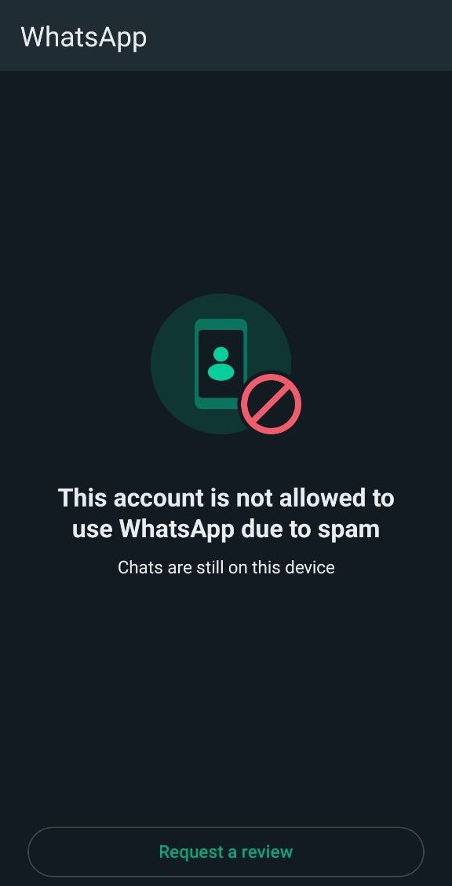

# GilBot WhatsApp

This is the source code for the WhatsApp bot. Since there is an issue with the WhatsApp policy, I make this project open source. Feel free to deploy on your own or add more features. Don't forget to give credit to this repository.



## Project Structure

### [GitHub workflow](.github/workflows/deploy.yml)

This is for continuous deployment to VPS with [pm2](https://pm2.keymetrics.io/).

### [Prisma ORM](prisma)

This is for configure the database (schema, migrations, seeders) with [Prisma](https://www.prisma.io/).

### [Main source](src)

#### [Assets](src/assets)

Store any assets which will be sent to the user.

#### [Commands](src/commands)

Store all available bot commands.

#### [Events](src/events)

Store action for registered events. Currently it only listen to message event, because all of the commands is based on message sent from the user.

#### [Libs](src/libs)

All of the utilities should be stored in here.

#### [Types](src/types)

Store type definition files.

## Command flow

If you checked on the all files in [commands](src/commands) folder, the command separated into 2 types:

- Command without `requireLock`

  ```mermaid
  flowchart LR
    A([Start]) --> |User sends 'message'| B[Parse Message]
    B --> C{Is the message<br>registered as a command?}
    C --> |Yes| D["Run command.execute()"]
    C --> |No| E["Run default command"]
    D --> F
    E --> F
    F[Send Response] --> G
    G([End])
  ```

- Command with `requireLock`

  ```mermaid
    flowchart LR
      A([Start]) --> |User sends 'message'| B[Parse Message]
      B --> C{Is message<br>registered as command?}
      C --> |Yes| D["Run command.execute()"] --> I[Create/Update Current Command]
      C --> |No| E["Run default command"]
      I --> |User sends parameters| H["Run command.generate()"]
      H --> F[Send Response] --> J[Reset Current Command]
      E --> K[Send Response]
      J --> G([End])
      K --> G
  ```

This `requireLock` configuration can be found in the [prisma data](prisma/data/commands.ts).
